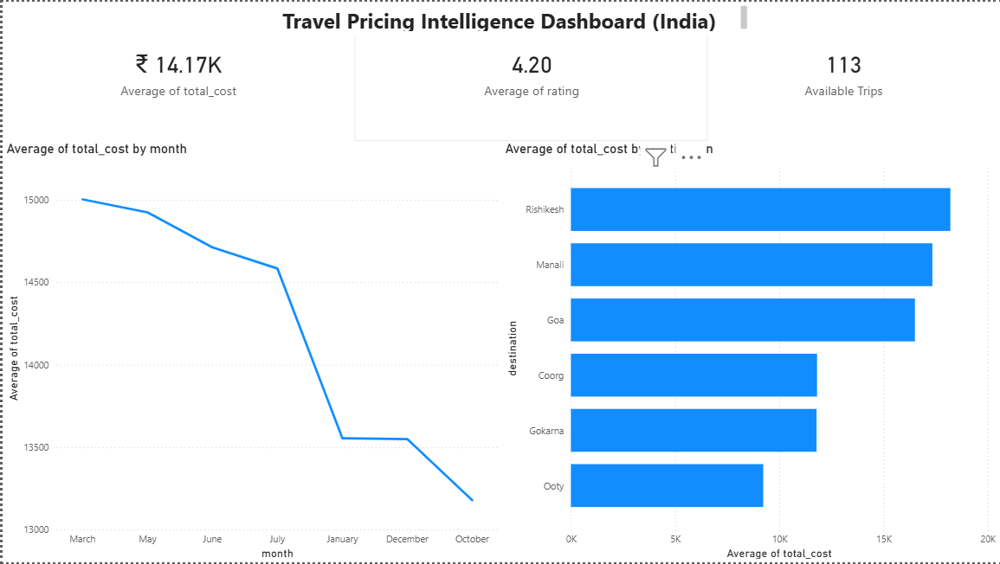
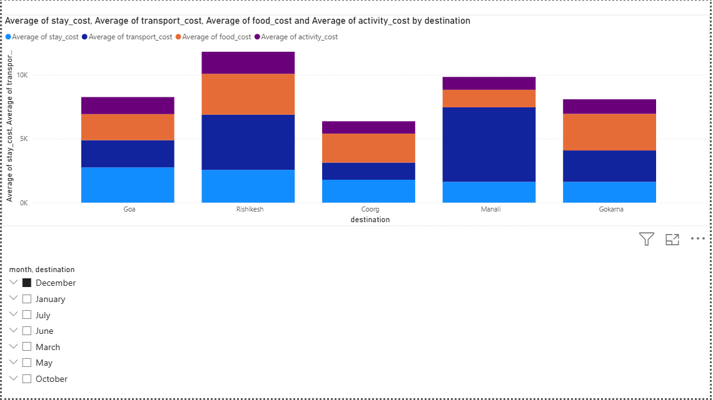
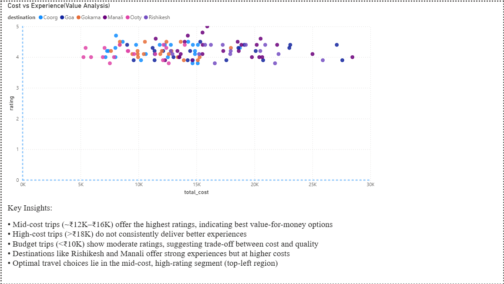

# Travel Pricing Intelligence & Analytics Dashboard (India)

This project analyzes end-to-end travel costs across Indian destinations to identify optimal travel options based on budget, season, and overall experience.

---

## 🎯 Objective

To model travel pricing and identify high-value travel experiences by analyzing cost components and user satisfaction (ratings).

---

## 📊 Dashboard Overview

### 1. Pricing Trends by Month

### 2. Cost Breakdown per Destination

### 3. Value Analysis (Cost vs Rating)

---

## ⚙️ Features

- End-to-end cost modeling (stay, transport, food, activities)
- Seasonal pricing trend analysis
- Destination-level cost comparison
- Recommendation logic based on budget and availability
- Value analysis using cost vs rating segmentation

---

## 🧠 Key Insights

- Mid-cost trips (~₹12K–₹16K) offer the best value for money  
- High-cost trips do not consistently deliver better experiences  
- Transport costs significantly impact total trip cost for distant destinations  
- Optimal travel choices lie in the mid-cost, high-rating range  

---

## 🛠️ Tech Stack

- Python (Pandas)  
- Power BI  
- Data Visualization  

---

---

## 🚀 How to Run

1. Clone the repository  
2. Run:py main.py
3. Open Power BI dashboard for visualization  

---

## 💡 Conclusion

This project demonstrates how data-driven analysis can be used to optimize travel decisions and improve user experience by identifying high-value options based on cost and satisfaction.

